# Milestone 05: measured adapter pilot

**Decision for adapter_pilot_v1: STOP_AFTER_MILESTONE_05.** The declared pilot gate is met: in both frozen and joint tracks, every selective-repair budget is beaten by restart or carry at the same or lower K, with a positive lower 95% paired-root bound. This recipe does not support a selective-repair paper claim. The separately added prompt 05b proposes a new exploratory protocol; it does not revise this outcome.

This is exploratory validation evidence for this training recipe, not proof that all selective-repair methods fail. No held-out test roots were generated or evaluated. Full raw predictions, including failures and unfavorable arms, are retained.

## Declared stopping comparison

Metric: mean post-edit exact-route accuracy across 32 edits. Average the three adapter seeds within each root, then resample 256 paired roots with all their frames (10,000 draws, seed 54037). Intervals are pointwise and conditional on these training seeds; the multi-budget screening is exploratory. The table shows the eligible baseline with the largest observed mean advantage; every comparison is in `pilot_results.json`. Gaps and intervals are percentage points.

| Track | Repair K | Baseline | Baseline K | Baseline − repair | 95% paired interval |
|---|---|---|---|---|---|
| frozen | 1 | carry | 1 | 10.74 | [8.11, 13.58] |
| frozen | 2 | restart | 2 | 25.87 | [21.57, 30.31] |
| frozen | 4 | restart | 4 | 40.05 | [35.75, 44.39] |
| frozen | 8 | restart | 8 | 45.95 | [41.64, 50.33] |
| joint | 1 | carry | 1 | 16.77 | [12.77, 20.82] |
| joint | 2 | restart | 2 | 31.96 | [27.68, 36.34] |
| joint | 4 | restart | 4 | 40.76 | [36.73, 44.82] |
| joint | 8 | restart | 8 | 43.65 | [39.89, 47.54] |

## Protocol and completed work

All 72 training runs completed 256 optimizer steps (18,432 total), batch 64, uniform K in {1,2,4,8}. The five frozen learned policies and seven joint policies each received two learning rates and seeds 29/43/71. Frozen restart/carry are parameter-free curves. Joint restart/carry received both backbone learning rates. The adapter and current frozen rollout remain differentiable; prior state is detached before adaptation.

All adapter seeds use the same passing static maze seed-29 checkpoint. These are adapter-seed replications conditional on one backbone, not three independent backbone replications. The backbone has width 64, two heads, inner count 2: each outer cycle executes three shared-block calls and six transformer layers. It is TRM-inspired, not an exact TRM/RSM reproduction.

Data: 1,024 training roots, four independently seeded one-toggle views per root; 256 validation roots and 32 uniform-toggle edits per root. Ancestry is kept together; test payloads stay unopened. The selected learning rate maximizes four-edit validation accuracy across all roots, budgets and three seeds, with a lower-rate tie break. Both tuning candidates remain published.

Shared frozen training caches contain model-generated states at the current run's own K, with observed-input/root/checkpoint/policy provenance. Joint priors are recomputed after every weight update. Deployed streams use their own fixed-K state, including the initial solve. The separate initializer intervention deliberately forks a common K=8 prior; it is never used as cheap stream history.

Local resets use radii 1/2/3. Random reset is calibrated to each selected spatial model's four-edit mean reset rate; noise scale is 0.01; shuffled gates use the trained spatial module. Answer-only is trained. Joint auxiliary initializer controls use the joint spatial backbone, whereas principal joint policies own separately trained backbones. These comparison types must remain distinct.

| Track / policy | Selected grid | Grid 0 score (%) | Grid 1 score (%) |
|---|---|---|---|
| frozen-answer_only | 1 | 43.18 | 72.05 |
| frozen-global_gate | 0 | 87.75 | 87.67 |
| frozen-gru_adapter | 0 | 84.63 | 62.74 |
| frozen-residual_adapter | 0 | 86.81 | 76.62 |
| frozen-spatial_gate | 0 | 86.36 | 84.84 |
| joint-answer_only | 1 | 83.11 | 86.74 |
| joint-carry | 1 | 86.88 | 87.71 |
| joint-global_gate | 0 | 85.35 | 84.24 |
| joint-gru_adapter | 0 | 79.45 | 73.41 |
| joint-residual_adapter | 0 | 84.68 | 83.54 |
| joint-restart | 0 | 79.67 | 79.38 |
| joint-spatial_gate | 0 | 84.49 | 78.64 |

## Frozen 32-edit curves

Mean post-edit route accuracy (%), with the training/control-seed minimum–maximum in parentheses. The frozen restart/carry curves are single fixed models. All-node, valid-action, unreachable/trivial denominators, whole-stream outcomes and all 33 per-frame curves are saved in `pilot_results.json`.

| Policy | K=1 | K=2 | K=4 | K=8 |
|---|---|---|---|---|
| restart | 36.46 (36.46–36.46) | 75.01 (75.01–75.01) | 90.21 (90.21–90.21) | 95.92 (95.92–95.92) |
| carry | 50.93 (50.93–50.93) | 50.31 (50.31–50.31) | 49.57 (49.57–49.57) | 49.58 (49.58–49.58) |
| spatial_gate | 40.19 (34.02–44.23) | 49.15 (48.13–50.00) | 50.16 (49.99–50.32) | 49.97 (49.91–50.02) |
| global_gate | 48.69 (44.74–50.87) | 50.23 (49.74–50.48) | 49.79 (49.65–50.07) | 49.74 (49.58–49.87) |
| gru_adapter | 27.29 (22.63–30.25) | 38.75 (37.61–40.75) | 50.03 (49.68–50.55) | 50.39 (49.67–51.40) |
| residual_adapter | 34.34 (29.33–40.86) | 49.28 (48.71–49.73) | 49.61 (49.27–49.90) | 49.66 (49.49–49.99) |
| answer_only | 24.91 (22.39–29.37) | 58.00 (53.65–64.27) | 79.79 (76.51–82.68) | 87.65 (83.79–90.08) |
| local_reset_1 | 19.76 (19.76–19.76) | 20.98 (20.98–20.98) | 21.66 (21.66–21.66) | 22.16 (22.16–22.16) |
| local_reset_2 | 16.47 (16.47–16.47) | 18.09 (18.09–18.09) | 18.73 (18.73–18.73) | 19.08 (19.08–19.08) |
| local_reset_3 | 15.69 (15.69–15.69) | 17.53 (17.53–17.53) | 18.23 (18.23–18.23) | 18.77 (18.77–18.77) |
| random_reset | 3.31 (3.27–3.34) | 4.55 (4.30–4.74) | 5.19 (4.96–5.33) | 5.59 (4.92–6.05) |
| noisy_carry | 50.92 (50.78–51.00) | 50.33 (50.32–50.37) | 49.55 (49.52–49.57) | 49.57 (49.55–49.58) |
| shuffled_gate | 35.83 (27.31–40.72) | 46.97 (45.08–48.08) | 49.93 (49.88–49.96) | 49.80 (49.72–49.95) |

## Joint 32-edit curves

Mean post-edit route accuracy (%), with the training/control-seed minimum–maximum in parentheses. The frozen restart/carry curves are single fixed models. All-node, valid-action, unreachable/trivial denominators, whole-stream outcomes and all 33 per-frame curves are saved in `pilot_results.json`.

| Policy | K=1 | K=2 | K=4 | K=8 |
|---|---|---|---|---|
| restart | 35.39 (34.97–35.75) | 75.41 (75.10–75.59) | 91.27 (90.48–92.79) | 99.70 (99.50–99.91) |
| carry | 51.79 (51.20–52.44) | 50.98 (50.40–51.28) | 49.79 (48.22–50.59) | 48.46 (47.29–50.04) |
| spatial_gate | 35.02 (33.92–35.72) | 43.45 (41.00–45.75) | 50.51 (47.13–55.11) | 56.05 (51.10–64.92) |
| global_gate | 38.94 (37.28–40.28) | 42.94 (42.04–43.64) | 49.55 (45.74–53.87) | 55.55 (46.81–62.73) |
| gru_adapter | 34.28 (31.15–36.76) | 33.87 (31.54–37.07) | 43.15 (33.94–48.93) | 54.25 (40.58–65.36) |
| residual_adapter | 24.89 (13.32–33.47) | 36.81 (30.54–42.36) | 39.00 (37.29–40.72) | 41.64 (39.54–43.30) |
| answer_only | 57.13 (55.21–58.28) | 81.69 (78.66–83.70) | 95.29 (92.93–97.42) | 99.31 (99.00–99.63) |
| local_reset_1 | 23.71 (23.25–24.12) | 26.52 (24.87–28.61) | 27.31 (25.01–29.41) | 26.56 (24.16–29.21) |
| local_reset_2 | 19.29 (18.92–19.58) | 22.73 (21.15–24.26) | 25.87 (24.13–27.39) | 27.08 (23.95–29.64) |
| local_reset_3 | 20.28 (19.79–20.96) | 24.36 (23.52–25.40) | 27.95 (26.54–29.28) | 29.06 (26.10–31.93) |
| random_reset | 4.19 (3.87–4.37) | 5.75 (5.41–6.03) | 8.50 (7.79–8.95) | 12.19 (9.75–13.53) |
| noisy_carry | 52.17 (50.23–53.77) | 51.14 (48.19–54.35) | 46.12 (43.92–48.08) | 40.60 (40.26–41.10) |
| shuffled_gate | 30.33 (26.98–33.96) | 40.44 (35.94–43.41) | 49.82 (46.03–53.69) | 53.89 (47.56–62.30) |

## Every principal training-seed curve

Post-edit route accuracy (%) over 32 edits; no seed is omitted.

| Track | Policy | Seed | K=1 | K=2 | K=4 | K=8 |
|---|---|---|---|---|---|---|
| frozen | answer_only | 29 | 22.97 | 53.65 | 76.51 | 83.79 |
| frozen | answer_only | 43 | 22.39 | 56.08 | 80.19 | 89.07 |
| frozen | answer_only | 71 | 29.37 | 64.27 | 82.68 | 90.08 |
| frozen | carry | 29 | 50.93 | 50.31 | 49.57 | 49.58 |
| frozen | global_gate | 29 | 44.74 | 49.74 | 50.07 | 49.87 |
| frozen | global_gate | 43 | 50.87 | 50.48 | 49.65 | 49.58 |
| frozen | global_gate | 71 | 50.45 | 50.48 | 49.65 | 49.78 |
| frozen | gru_adapter | 29 | 22.63 | 40.75 | 50.55 | 49.67 |
| frozen | gru_adapter | 43 | 30.25 | 37.61 | 49.68 | 50.09 |
| frozen | gru_adapter | 71 | 29.00 | 37.89 | 49.87 | 51.40 |
| frozen | residual_adapter | 29 | 40.86 | 49.41 | 49.27 | 49.50 |
| frozen | residual_adapter | 43 | 29.33 | 48.71 | 49.90 | 49.49 |
| frozen | residual_adapter | 71 | 32.82 | 49.73 | 49.66 | 49.99 |
| frozen | restart | 29 | 36.46 | 75.01 | 90.21 | 95.92 |
| frozen | spatial_gate | 29 | 34.02 | 48.13 | 50.32 | 49.91 |
| frozen | spatial_gate | 43 | 44.23 | 49.30 | 50.17 | 49.98 |
| frozen | spatial_gate | 71 | 42.32 | 50.00 | 49.99 | 50.02 |
| joint | answer_only | 29 | 58.28 | 83.70 | 95.52 | 99.00 |
| joint | answer_only | 43 | 55.21 | 78.66 | 92.93 | 99.30 |
| joint | answer_only | 71 | 57.91 | 82.70 | 97.42 | 99.63 |
| joint | carry | 29 | 52.44 | 51.28 | 50.59 | 50.04 |
| joint | carry | 43 | 51.20 | 50.40 | 48.22 | 47.29 |
| joint | carry | 71 | 51.73 | 51.26 | 50.56 | 48.05 |
| joint | global_gate | 29 | 37.28 | 43.15 | 45.74 | 46.81 |
| joint | global_gate | 43 | 40.28 | 42.04 | 49.04 | 57.09 |
| joint | global_gate | 71 | 39.26 | 43.64 | 53.87 | 62.73 |
| joint | gru_adapter | 29 | 31.15 | 33.01 | 46.58 | 56.81 |
| joint | gru_adapter | 43 | 34.92 | 31.54 | 33.94 | 40.58 |
| joint | gru_adapter | 71 | 36.76 | 37.07 | 48.93 | 65.36 |
| joint | residual_adapter | 29 | 33.47 | 42.36 | 37.29 | 39.54 |
| joint | residual_adapter | 43 | 27.88 | 37.52 | 40.72 | 43.30 |
| joint | residual_adapter | 71 | 13.32 | 30.54 | 38.99 | 42.08 |
| joint | restart | 29 | 35.44 | 75.10 | 90.55 | 99.69 |
| joint | restart | 43 | 34.97 | 75.55 | 90.48 | 99.50 |
| joint | restart | 71 | 35.75 | 75.59 | 92.79 | 99.91 |
| joint | spatial_gate | 29 | 33.92 | 41.00 | 47.13 | 51.10 |
| joint | spatial_gate | 43 | 35.72 | 45.75 | 55.11 | 64.92 |
| joint | spatial_gate | 71 | 35.41 | 43.60 | 49.28 | 52.14 |

## Frozen initializer interventions

The challenge sampler retained 118 low/high pairs: 54 additions and 64 removals. Ten requested addition pairs were unavailable; thresholds and roots were not changed. Ordinary toggles and conditioned challenge pairs are separate suites; challenge prevalence is not ordinary prevalence.

The following selected contrast compares spatial gates with shuffled versions of the same trained gates on the same prior and frozen weights. Values are spatial-minus-shuffled route accuracy in percentage points, averaged across seeds before root resampling. This is an exploratory placement diagnostic, not evidence of ground-truth latent invalidation. Every baseline, stratum, budget and seed is available in the machine-readable report.

| Track | Suite | Stratum | K | Roots | Spatial − shuffled | 95% paired interval |
|---|---|---|---|---|---|---|
| frozen | challenge | high | 1 | 118 | 0.00 | [0.00, 0.00] |
| frozen | challenge | high | 2 | 118 | 1.69 | [0.00, 3.95] |
| frozen | challenge | high | 4 | 118 | 1.69 | [0.00, 3.95] |
| frozen | challenge | high | 8 | 118 | 1.13 | [0.00, 2.54] |
| frozen | challenge | low | 1 | 118 | 0.00 | [0.00, 0.00] |
| frozen | challenge | low | 2 | 118 | 0.00 | [0.00, 0.00] |
| frozen | challenge | low | 4 | 118 | 0.00 | [0.00, 0.00] |
| frozen | challenge | low | 8 | 118 | 0.00 | [0.00, 0.00] |
| frozen | ordinary | high | 1 | 4 | 0.00 | [0.00, 0.00] |
| frozen | ordinary | high | 2 | 4 | 16.67 | [-25.00, 75.00] |
| frozen | ordinary | high | 4 | 4 | 25.00 | [0.00, 75.00] |
| frozen | ordinary | high | 8 | 4 | 25.00 | [0.00, 75.00] |
| frozen | ordinary | low | 1 | 243 | 0.00 | [0.00, 0.00] |
| frozen | ordinary | low | 2 | 243 | 0.14 | [0.00, 0.41] |
| frozen | ordinary | low | 4 | 243 | 0.14 | [0.00, 0.41] |
| frozen | ordinary | low | 8 | 243 | 0.14 | [0.00, 0.41] |
| joint | challenge | high | 1 | 118 | -4.80 | [-8.19, -1.98] |
| joint | challenge | high | 2 | 118 | -1.98 | [-3.95, -0.00] |
| joint | challenge | high | 4 | 118 | 0.28 | [-1.98, 2.82] |
| joint | challenge | high | 8 | 118 | 1.98 | [-1.13, 5.37] |
| joint | challenge | low | 1 | 118 | -1.13 | [-5.08, 2.54] |
| joint | challenge | low | 2 | 118 | 0.00 | [-1.98, 1.98] |
| joint | challenge | low | 4 | 118 | 1.13 | [-0.00, 2.54] |
| joint | challenge | low | 8 | 118 | 0.56 | [-0.56, 1.69] |
| joint | ordinary | high | 1 | 4 | -16.67 | [-50.00, 0.00] |
| joint | ordinary | high | 2 | 4 | 0.00 | [0.00, 0.00] |
| joint | ordinary | high | 4 | 4 | 8.33 | [-25.00, 50.00] |
| joint | ordinary | high | 8 | 4 | 16.67 | [0.00, 50.00] |
| joint | ordinary | low | 1 | 243 | 0.27 | [-2.33, 2.88] |
| joint | ordinary | low | 2 | 243 | 1.23 | [-0.55, 3.02] |
| joint | ordinary | low | 4 | 243 | 0.55 | [-0.55, 1.65] |
| joint | ordinary | low | 8 | 243 | 0.55 | [-0.14, 1.37] |

## Earlier gates and failures

Step 1 passed on the original 8×8 frozen-state challenge at K=4: carry-minus-restart was +12.20 pp on low-impact edits (95% interval +3.66 to +21.95) and −24.39 pp on high-impact edits (−34.15 to −15.85). Ordinary validation had only two high-impact roots, so it did not independently establish that crossover. This supported asking the adapter question, not assuming a positive answer.

All three scaled maze seeds passed the ordinary nondecreasing/≥85% gate. Exact-route counts below use 256 roots per suite.

| Seed | Suite | K=1 | K=2 | K=4 | K=8 | K=16 |
|---|---|---|---|---|---|---|
| 29 | ordinary | 100 | 211 | 255 | 256 | 256 |
| 29 | rooms | 112 | 206 | 253 | 256 | 256 |
| 29 | size16 | 61 | 154 | 241 | 252 | 252 |
| 43 | ordinary | 99 | 211 | 254 | 255 | 255 |
| 43 | rooms | 115 | 201 | 252 | 255 | 255 |
| 43 | size16 | 48 | 149 | 232 | 249 | 250 |
| 71 | ordinary | 97 | 206 | 254 | 256 | 256 |
| 71 | rooms | 113 | 201 | 251 | 254 | 254 |
| 71 | size16 | 56 | 148 | 240 | 248 | 248 |

All three completed circuit v1.2 seeds passed ordinary nondecreasing/≥85% exact correctness. Deeper 48-node circuits retained a large gap. Counts below use 256 roots.

| Seed | Suite | K=1 | K=2 | K=4 | K=8 | K=16 |
|---|---|---|---|---|---|---|
| 29 | ordinary | 252 | 256 | 256 | 256 | 256 |
| 29 | depth48 | 4 | 52 | 149 | 168 | 168 |
| 43 | ordinary | 254 | 256 | 256 | 256 | 256 |
| 43 | depth48 | 3 | 53 | 144 | 154 | 154 |
| 71 | ordinary | 252 | 256 | 256 | 256 | 256 |
| 71 | depth48 | 1 | 62 | 154 | 163 | 163 |

Preserved failures: width-128 maze capacity and batch-256 circuit capacity exhausted the configured allocator allowance; the maze used the declared width-64 fallback and circuits used batch 128. Circuit v1.1 seed 29 hit its training-time cap at 2,905/6,000 steps and is excluded from the completed three-seed matrix. Version 1.2 cached immutable training observations and restarted every circuit seed from scratch. A first transfer-parity diagnostic failed a bitwise criterion; the subsequent declared 1e-5 tolerance passed with identical labels. No held-out threshold or generator was retuned.

The 256-step adapter pilot does not establish convergence. Answer-only losses fell substantially; GRU and residual adapters were sensitive to learning rate, and one-edit training did not guarantee stable long streams. First/last-32-step losses, all gradients and both candidate checkpoints are retained. The negative decision applies to this bounded recipe.

## Verification and numerical limits

The independent checker verified 72 training runs, 368,640 tuning predictions, 2,500,608 stream predictions and 129,888 initializer predictions. It reconstructed training schedules, optimizer steps, fixed-K provenance, all raw action scores and paired coverage. It did not replay every forward pass.

A separate CPU audit exactly regenerated challenge selection and checked all 64 training-cache batches and 48 intervention-prior batches against original observed inputs. The deterministic principal-policy spot replay used the first two validation roots, all seeds, endpoint K=1/8 and all 33 frames: 5,016 predictions / 722,304 node actions. It found 1,846 action differences, three route-decision differences and no all-node-correctness differences between CPU torch 2.14 and saved CUDA torch 2.11 results.

A repeat of every discrepant case in the original CUDA runtime matched all 25,344 predictions exactly at batch 64. Within torch 2.11, initial CPU/CUDA logit differences were at most 4.864e-5; they grew in some long streams, reaching 12.30 at the final frame. CPU torch 2.11 and CPU torch 2.14 also differed on some actions. Numerical sensitivity across backends/versions is therefore a real limitation; cross-platform bitwise reproducibility is not claimed. The saved CUDA result and stop screen were not replaced with a favorable replay.

The full CPU suite passed 277 tests before the pilot; the final verification log is `runs/prompt05-final-tests.txt`. Tests cover typed information boundaries, nonzero adapter gradients, intentional broken detach, padding, stream budget ownership, raw-artifact rejection and synthetic-record exclusion. Evaluator memoization was added only after GPU runs completed and preserves exact scoring of every raw action record.

## Resources and reproducibility

Cumulative local GPU-job wall time, including failed jobs, profiles and the replay diagnostic: **8.7003 hours**, leaving **1.2997** of the user-approved ten hours. All 171 reservations are reconciled. Recorded external charges: $0.00; electricity remains unmeasured. Whole-job time includes CPU setup/scoring inside each job context. This is not a hardware speedup measurement.

Float32, RTX 5070, torch 2.11.0+cu128, TF32 disabled; six-GiB allocator cap and declared 7.5-GiB estimate including runtime headroom. Batch sizes are 64 for the maze pilot, 128 for completed circuits. Source snapshots, checkpoints, RNG/optimizer state, configurations, raw predictions and resource records are packaged under `reports/evidence/prompt05/`, with per-file SHA-256 manifests. Synthetic capacity profiles remain explicitly separate from empirical result tables.

Restore the evidence ZIPs into a clean checkout to recreate their `runs/` paths. Use the recorded environment for numerical replay. Recheck with `.venv/Scripts/python.exe scripts/check_adapter_pilot.py --output runs/recheck.json`; regenerate this report with `.venv/Scripts/python.exe scripts/build_adapter_pilot_report.py`. The JSON report contains source hashes, all per-frame/seed/stratum metrics, selection candidates, paired contrasts and the full stopping screen.

## Stopping boundary

Milestone 05 is complete with a negative pilot outcome. The updated local plan specifies 05b, then 06–08; none has run. Prompt 05b would test stream training and output reuse as a new exploratory version, preserving the original stop. There is no confirmatory test, frozen test operating point, warmed batch-one latency frontier, final adversarial-audit milestone, or manuscript. Soft gates still execute dense work; no FLOP/latency reduction is claimed. Established state reuse and gating precedents remain credited in PROPOSAL.md; neither this architecture nor this negative pilot is claimed as a new publishable contribution.

## Prompt 05b: stream training and output reuse

All results below are exploratory validation on paired roots, conditional on the three training seeds. No held-out test roots were used. The original pilot result above remains unchanged.

Training uses four sequential edits after a fresh initial solve; five frame losses are weighted equally, state is detached at each version, and one optimizer update follows the stream. The 256 steps match v1 optimizer steps, not data or compute: five rollouts replace two. Seed schedules and exact block-call totals are in `stream_results.json`.

**G2, latent reuse:** no latent-reuse arm has a positive lower 95% bound versus answer-only at any tested K; close this claim for this backbone family and tested recipe.

**G3, maze output reuse at K1/2/4:** all three lower bounds are positive.

### Maze 32-edit accuracy

Mean post-edit exact-route/unreachable correctness (%). Auxiliary maze controls use each trained spatial backbone.

| Policy | K1 | K2 | K4 | K8 |
|---|---|---|---|---|
| restart | 35.83 | 75.42 | 94.27 | 100.00 |
| carry | 63.30 | 67.30 | 66.35 | 63.46 |
| spatial_gate | 60.49 | 77.91 | 89.35 | 94.45 |
| global_gate | 57.16 | 80.48 | 88.69 | 95.04 |
| gru_adapter | 54.69 | 71.78 | 87.01 | 91.36 |
| residual_adapter | 41.64 | 55.80 | 66.11 | 72.49 |
| answer_only | 68.37 | 87.50 | 98.19 | 99.82 |
| local_reset_1 | 28.21 | 32.12 | 33.09 | 34.11 |
| local_reset_2 | 24.32 | 28.67 | 31.78 | 33.37 |
| local_reset_3 | 23.82 | 30.07 | 34.79 | 37.07 |
| random_reset | 5.96 | 9.70 | 16.20 | 30.21 |
| noisy_carry | 55.09 | 50.84 | 45.15 | 40.18 |
| shuffled_gate | 37.62 | 56.64 | 73.58 | 82.85 |

Training-seed variability is shown separately below. The subsequent paired-root intervals describe example variability conditional on these seeds; they are not intervals over training randomness.

| Policy | Training seed | K1 (%) | K2 (%) | K4 (%) | K8 (%) |
|---|---|---|---|---|---|
| restart | 29 | 35.86 | 75.44 | 93.90 | 100.00 |
| restart | 43 | 35.31 | 75.48 | 94.49 | 100.00 |
| restart | 71 | 36.30 | 75.34 | 94.41 | 100.00 |
| carry | 29 | 62.74 | 66.72 | 66.21 | 62.49 |
| carry | 43 | 64.39 | 68.58 | 66.42 | 64.47 |
| carry | 71 | 62.76 | 66.60 | 66.42 | 63.44 |
| spatial_gate | 29 | 63.71 | 77.21 | 92.69 | 95.74 |
| spatial_gate | 43 | 61.54 | 80.88 | 89.81 | 93.20 |
| spatial_gate | 71 | 56.21 | 75.62 | 85.55 | 94.42 |
| global_gate | 29 | 57.08 | 78.56 | 86.32 | 95.90 |
| global_gate | 43 | 56.19 | 81.40 | 88.75 | 94.04 |
| global_gate | 71 | 58.20 | 81.47 | 91.02 | 95.17 |
| gru_adapter | 29 | 66.53 | 72.63 | 89.44 | 95.59 |
| gru_adapter | 43 | 40.56 | 66.04 | 79.92 | 85.19 |
| gru_adapter | 71 | 56.97 | 76.66 | 91.66 | 93.29 |
| residual_adapter | 29 | 45.26 | 56.86 | 66.39 | 76.43 |
| residual_adapter | 43 | 39.11 | 54.27 | 63.99 | 70.59 |
| residual_adapter | 71 | 40.55 | 56.26 | 67.96 | 70.43 |
| answer_only | 29 | 66.67 | 85.88 | 97.88 | 99.66 |
| answer_only | 43 | 69.79 | 89.09 | 98.55 | 99.94 |
| answer_only | 71 | 68.65 | 87.54 | 98.13 | 99.87 |
| local_reset_1 | 29 | 26.89 | 30.70 | 32.82 | 35.07 |
| local_reset_1 | 43 | 28.89 | 32.24 | 33.20 | 33.22 |
| local_reset_1 | 71 | 28.83 | 33.42 | 33.25 | 34.05 |
| local_reset_2 | 29 | 23.65 | 27.43 | 30.62 | 32.03 |
| local_reset_2 | 43 | 24.34 | 28.98 | 31.68 | 33.76 |
| local_reset_2 | 71 | 24.99 | 29.59 | 33.04 | 34.30 |
| local_reset_3 | 29 | 22.97 | 29.42 | 32.74 | 35.10 |
| local_reset_3 | 43 | 23.36 | 29.97 | 35.05 | 37.40 |
| local_reset_3 | 71 | 25.11 | 30.82 | 36.58 | 38.72 |
| random_reset | 29 | 6.14 | 9.69 | 15.37 | 24.96 |
| random_reset | 43 | 5.58 | 9.08 | 14.69 | 27.86 |
| random_reset | 71 | 6.16 | 10.34 | 18.54 | 37.81 |
| noisy_carry | 29 | 51.98 | 48.89 | 44.63 | 38.83 |
| noisy_carry | 43 | 57.24 | 51.76 | 45.28 | 40.78 |
| noisy_carry | 71 | 56.04 | 51.88 | 45.56 | 40.93 |
| shuffled_gate | 29 | 35.77 | 51.76 | 70.47 | 80.70 |
| shuffled_gate | 43 | 38.51 | 57.64 | 71.91 | 78.45 |
| shuffled_gate | 71 | 38.57 | 60.52 | 78.37 | 89.39 |

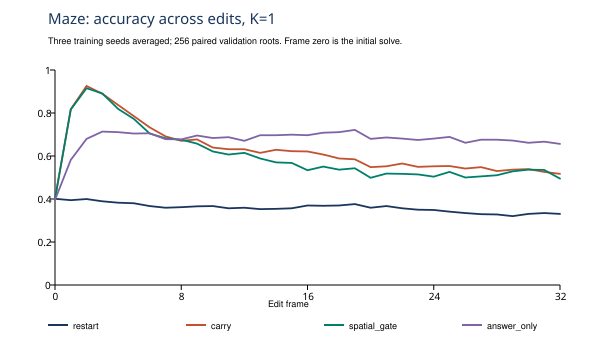

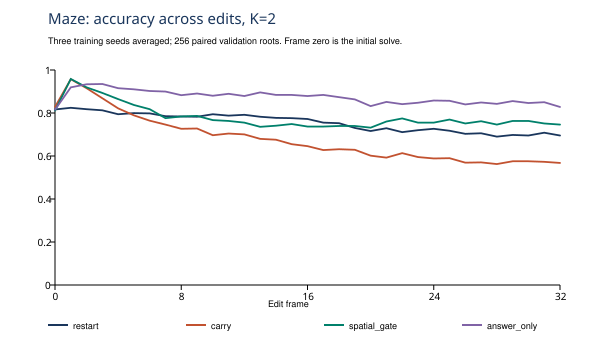

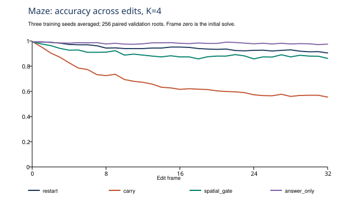

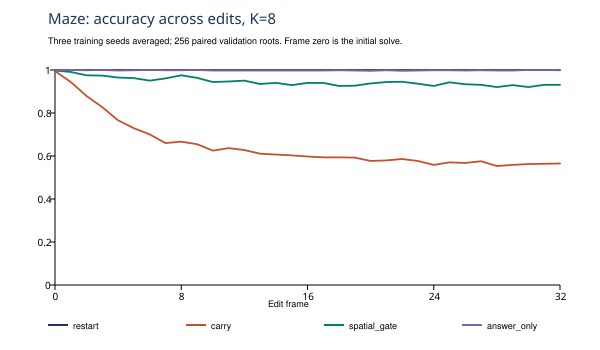

| Arm − comparator | K | Difference (pp) | Paired 95% interval (pp) |
|---|---|---|---|
| carry − answer_only | 1 | -5.07 | [-9.11, -1.11] |
| carry − answer_only | 2 | -20.20 | [-23.95, -16.51] |
| carry − answer_only | 4 | -31.84 | [-35.27, -28.48] |
| carry − answer_only | 8 | -36.36 | [-40.08, -32.64] |
| spatial_gate − answer_only | 1 | -7.89 | [-11.45, -4.41] |
| spatial_gate − answer_only | 2 | -9.59 | [-12.50, -6.67] |
| spatial_gate − answer_only | 4 | -8.84 | [-10.51, -7.24] |
| spatial_gate − answer_only | 8 | -5.37 | [-6.78, -4.14] |
| global_gate − answer_only | 1 | -11.21 | [-14.94, -7.58] |
| global_gate − answer_only | 2 | -7.02 | [-9.62, -4.45] |
| global_gate − answer_only | 4 | -9.49 | [-11.25, -7.86] |
| global_gate − answer_only | 8 | -4.79 | [-6.36, -3.39] |
| gru_adapter − answer_only | 1 | -13.68 | [-17.43, -9.94] |
| gru_adapter − answer_only | 2 | -15.72 | [-19.21, -12.18] |
| gru_adapter − answer_only | 4 | -11.18 | [-13.12, -9.29] |
| gru_adapter − answer_only | 8 | -8.46 | [-10.13, -6.91] |
| residual_adapter − answer_only | 1 | -26.73 | [-31.46, -22.07] |
| residual_adapter − answer_only | 2 | -31.70 | [-35.82, -27.57] |
| residual_adapter − answer_only | 4 | -32.07 | [-35.14, -29.00] |
| residual_adapter − answer_only | 8 | -27.34 | [-30.42, -24.38] |
| answer_only − restart | 1 | 32.54 | [28.46, 36.64] |
| answer_only − restart | 2 | 12.08 | [9.16, 15.11] |
| answer_only − restart | 4 | 3.92 | [2.17, 5.91] |
| answer_only − restart | 8 | -0.18 | [-0.38, -0.06] |

### Maze frozen-prior initializer interventions

Every initializer below uses the selected spatial backbone's identical K8 prior. Rates are descriptive branch averages within a stratum, averaged over the three seeds. Ordinary and conditioned challenge suites remain separate; every intermediate K, stratum and seed is in the machine-readable results.

| Suite | Initializer | Low K1 (%) | High K1 (%) | Low K8 (%) | High K8 (%) |
|---|---|---|---|---|---|
| ordinary | restart | 40.47 | 25.00 | 99.59 | 100.00 |
| ordinary | carry | 95.75 | 58.33 | 66.39 | 50.00 |
| ordinary | spatial_gate | 77.09 | 41.67 | 99.45 | 75.00 |
| ordinary | local_reset_1 | 86.56 | 50.00 | 58.44 | 50.00 |
| ordinary | local_reset_2 | 77.23 | 50.00 | 55.42 | 58.33 |
| ordinary | local_reset_3 | 72.57 | 50.00 | 54.73 | 50.00 |
| ordinary | random_reset | 9.74 | 16.67 | 25.38 | 41.67 |
| ordinary | noisy_carry | 95.75 | 58.33 | 66.53 | 50.00 |
| ordinary | shuffled_gate | 71.88 | 33.33 | 95.75 | 50.00 |
| challenge | restart | 35.03 | 16.38 | 99.72 | 98.59 |
| challenge | carry | 92.94 | 29.66 | 73.16 | 43.50 |
| challenge | spatial_gate | 79.10 | 23.16 | 98.31 | 86.16 |
| challenge | local_reset_1 | 78.81 | 25.42 | 58.76 | 43.50 |
| challenge | local_reset_2 | 77.97 | 26.84 | 61.58 | 45.48 |
| challenge | local_reset_3 | 71.19 | 26.27 | 55.93 | 46.61 |
| challenge | random_reset | 9.89 | 5.93 | 25.42 | 43.50 |
| challenge | noisy_carry | 92.94 | 29.66 | 73.45 | 43.50 |
| challenge | shuffled_gate | 75.71 | 26.27 | 95.20 | 75.71 |

### Maze carried-state dynamics (G1)

Each comparison forks an identical prior. Changed argmax actions disprove exact action invariance; they do not by themselves show useful correction or an exact latent fixed point.

| Backbone | Seed | Stratum | Branches | All-node change fraction | Scored-node change fraction | Low-K accuracy | High-K accuracy |
|---|---|---|---|---|---|---|---|
| pilot/carry | 29 | low | 361 | 0.00042320714065866423 | 0.00042320714065866423 | 0.9556786703601108 | 0.9556786703601108 |
| pilot/carry | 29 | middle | 9 | 0.0 | 0.0 | 0.8888888888888888 | 0.8888888888888888 |
| pilot/carry | 29 | high | 122 | 0.19421675774134792 | 0.19421675774134792 | 0.30327868852459017 | 0.30327868852459017 |
| stream/carry | 29 | low | 361 | 0.02169898430286242 | 0.02169898430286242 | 0.9445983379501385 | 0.9445983379501385 |
| stream/carry | 29 | middle | 9 | 0.09799382716049383 | 0.09799382716049383 | 0.8888888888888888 | 0.8888888888888888 |
| stream/carry | 29 | high | 122 | 0.4089822404371585 | 0.4089822404371585 | 0.29508196721311475 | 0.5163934426229508 |
| stream/carry | 43 | low | 361 | 0.021660510926438906 | 0.021660510926438906 | 0.9473684210526315 | 0.9473684210526315 |
| stream/carry | 43 | middle | 9 | 0.09104938271604938 | 0.09104938271604938 | 0.8888888888888888 | 0.8888888888888888 |
| stream/carry | 43 | high | 122 | 0.48389116575591984 | 0.48389116575591984 | 0.29508196721311475 | 0.6147540983606558 |
| stream/carry | 71 | low | 361 | 0.022410741766697446 | 0.022410741766697446 | 0.9529085872576177 | 0.9362880886426593 |
| stream/carry | 71 | middle | 9 | 0.09490740740740741 | 0.09490740740740741 | 0.8888888888888888 | 0.8888888888888888 |
| stream/carry | 71 | high | 122 | 0.3856443533697632 | 0.3856443533697632 | 0.30327868852459017 | 0.45901639344262296 |
| stream/spatial_gate | 29 | low | 361 | 0.03462603878116344 | 0.03462603878116344 | 0.9529085872576177 | 0.8614958448753463 |
| stream/spatial_gate | 29 | middle | 9 | 0.06172839506172839 | 0.06172839506172839 | 0.8888888888888888 | 0.7777777777777778 |
| stream/spatial_gate | 29 | high | 122 | 0.21948998178506376 | 0.21948998178506376 | 0.3114754098360656 | 0.3114754098360656 |
| stream/spatial_gate | 43 | low | 361 | 0.35489766081871343 | 0.35489766081871343 | 0.9445983379501385 | 0.554016620498615 |
| stream/spatial_gate | 43 | middle | 9 | 0.4575617283950617 | 0.4575617283950617 | 0.8888888888888888 | 0.7777777777777778 |
| stream/spatial_gate | 43 | high | 122 | 0.6053620218579235 | 0.6053620218579235 | 0.30327868852459017 | 0.6147540983606558 |
| stream/spatial_gate | 71 | low | 361 | 0.14943059402893197 | 0.14943059402893197 | 0.9473684210526315 | 0.6426592797783933 |
| stream/spatial_gate | 71 | middle | 9 | 0.1697530864197531 | 0.1697530864197531 | 0.8888888888888888 | 0.6666666666666666 |
| stream/spatial_gate | 71 | high | 122 | 0.3600865209471767 | 0.3600865209471767 | 0.30327868852459017 | 0.38524590163934425 |

### Maze answer-content lesions

Evaluation-time lesions replace previous probabilities with uniform or shuffled-node probabilities. These are not deployable policies. A fall relative to intact answer-only supports dependence on answer content; comparison to separately trained restart is descriptive.

| Version | Lesion | Comparator | K | Lesion − comparator (pp) | 95% interval (pp) |
|---|---|---|---|---|---|
| pilot | uniform | answer_only | 1 | -20.52 | [-23.38, -17.67] |
| pilot | uniform | answer_only | 2 | -12.61 | [-15.50, -9.72] |
| pilot | uniform | answer_only | 4 | -1.57 | [-2.60, -0.59] |
| pilot | uniform | answer_only | 8 | 0.61 | [0.26, 1.05] |
| pilot | uniform | restart | 1 | 1.22 | [-2.46, 4.88] |
| pilot | uniform | restart | 2 | -6.33 | [-8.63, -4.17] |
| pilot | uniform | restart | 4 | 2.45 | [0.92, 4.09] |
| pilot | uniform | restart | 8 | 0.22 | [-0.08, 0.64] |
| pilot | shuffled_nodes | answer_only | 1 | -35.09 | [-37.93, -32.35] |
| pilot | shuffled_nodes | answer_only | 2 | -45.08 | [-47.94, -42.23] |
| pilot | shuffled_nodes | answer_only | 4 | -42.03 | [-44.19, -39.90] |
| pilot | shuffled_nodes | answer_only | 8 | -38.17 | [-40.66, -35.71] |
| pilot | shuffled_nodes | restart | 1 | -13.35 | [-17.13, -9.68] |
| pilot | shuffled_nodes | restart | 2 | -38.81 | [-42.05, -35.64] |
| pilot | shuffled_nodes | restart | 4 | -38.01 | [-40.56, -35.52] |
| pilot | shuffled_nodes | restart | 8 | -38.56 | [-41.09, -35.99] |
| stream | uniform | answer_only | 1 | -33.63 | [-37.21, -29.99] |
| stream | uniform | answer_only | 2 | -17.21 | [-20.61, -13.92] |
| stream | uniform | answer_only | 4 | -1.36 | [-2.31, -0.51] |
| stream | uniform | answer_only | 8 | 0.17 | [0.05, 0.37] |
| stream | uniform | restart | 1 | -1.09 | [-3.89, 1.71] |
| stream | uniform | restart | 2 | -5.13 | [-7.76, -2.77] |
| stream | uniform | restart | 4 | 2.56 | [0.90, 4.37] |
| stream | uniform | restart | 8 | -0.01 | [-0.02, 0.00] |
| stream | shuffled_nodes | answer_only | 1 | -44.86 | [-48.42, -41.26] |
| stream | shuffled_nodes | answer_only | 2 | -38.20 | [-41.87, -34.50] |
| stream | shuffled_nodes | answer_only | 4 | -24.37 | [-26.50, -22.34] |
| stream | shuffled_nodes | answer_only | 8 | -18.62 | [-20.01, -17.21] |
| stream | shuffled_nodes | restart | 1 | -12.32 | [-15.57, -9.25] |
| stream | shuffled_nodes | restart | 2 | -26.12 | [-29.73, -22.73] |
| stream | shuffled_nodes | restart | 4 | -20.45 | [-22.68, -18.31] |
| stream | shuffled_nodes | restart | 8 | -18.80 | [-20.20, -17.37] |

Audit caveat: the uniform-probability lesion at K4 retains a 2.56-percentage-point advantage over restart, with paired 95% interval [0.90, 4.37]. This small content-free residual is consistent with a stronger jointly trained backbone/constant initializer; this lesion does not isolate the backbone from its learned projection. It is minor beside the intact answer-only K1 advantage of 32.54 points, but the full gain cannot be attributed solely to informative previous answers.

### Maze retention by stratum

Descriptive pooled-node retention, averaged over a/z. Twenty-bin histograms and per-branch means are saved in `stream_results.json`; nodes are not independent experimental replicates. Distant nodes are beyond two hops in current observed undirected adjacency.

| Stratum | Node group | Nodes | Mean retention | Standard deviation |
|---|---|---|---|---|
| low | all | 155952 | 0.20654664705442005 | 0.13471155966581483 |
| low | edited | 2166 | 0.1573838743545452 | 0.07898532758919806 |
| low | distant | 145551 | 0.20720571091002538 | 0.13534117096053502 |
| middle | all | 3888 | 0.18842210807864374 | 0.11690460108165512 |
| middle | edited | 54 | 0.11710692748979286 | 0.014343063649263285 |
| middle | distant | 3615 | 0.19196751553199434 | 0.1199627566508415 |
| high | all | 52704 | 0.23556305456985158 | 0.15753183276160443 |
| high | edited | 732 | 0.16780797059296584 | 0.0733076289505271 |
| high | distant | 49047 | 0.2375145989713444 | 0.15855136559268704 |

Observed pooled mean-retention differences: low minus high impact = -0.029016; edited minus distant = -0.049822 on low-impact branches and -0.069707 on high-impact branches. These describe the saved gates and do not establish a causal mechanism.

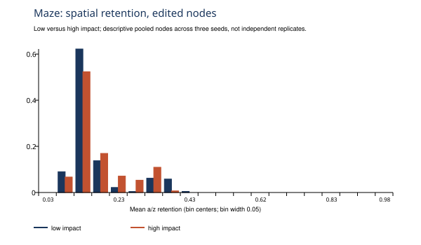

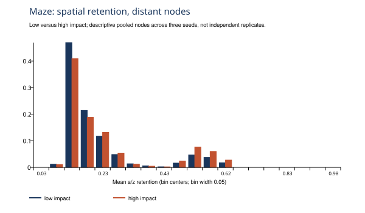

### Circuit 32-edit accuracy

Mean post-edit full-circuit correctness (%); input copies are excluded from scoring. Node accuracy and every frame/seed are included in the machine-readable results.

| Policy | K1 | K2 |
|---|---|---|
| restart | 99.21 | 100.00 |
| carry | 6.77 | 15.14 |
| spatial_gate | 99.27 | 99.93 |
| answer_only | 99.00 | 99.96 |

Training-seed variability is shown separately below. The subsequent paired-root intervals describe example variability conditional on these seeds; they are not intervals over training randomness.

| Policy | Training seed | K1 (%) | K2 (%) |
|---|---|---|---|
| restart | 29 | 99.22 | 100.00 |
| restart | 43 | 99.21 | 100.00 |
| restart | 71 | 99.22 | 100.00 |
| carry | 29 | 6.57 | 14.86 |
| carry | 43 | 6.48 | 10.49 |
| carry | 71 | 7.26 | 20.08 |
| spatial_gate | 29 | 99.24 | 99.94 |
| spatial_gate | 43 | 99.44 | 99.95 |
| spatial_gate | 71 | 99.13 | 99.90 |
| answer_only | 29 | 99.37 | 99.94 |
| answer_only | 43 | 99.28 | 99.99 |
| answer_only | 71 | 98.36 | 99.95 |

Mean post-edit non-input-node accuracy (%):

| Policy | K1 | K2 |
|---|---|---|
| restart | 99.96 | 100.00 |
| carry | 78.15 | 83.79 |
| spatial_gate | 99.96 | 99.99 |
| answer_only | 99.95 | 100.00 |

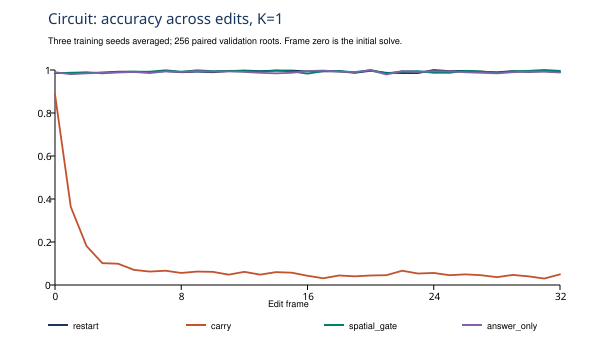

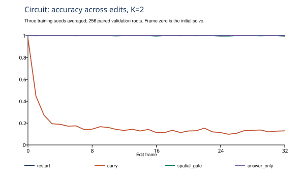

| Arm − comparator | K | Difference (pp) | Paired 95% interval (pp) |
|---|---|---|---|
| answer_only − restart | 1 | -0.21 | [-0.58, 0.15] |
| answer_only − restart | 2 | -0.04 | [-0.09, -0.01] |
| carry − restart | 1 | -92.44 | [-93.23, -91.60] |
| carry − restart | 2 | -84.86 | [-85.72, -83.99] |

### Circuit carried-state dynamics (G1)

Each comparison forks an identical prior. Changed argmax actions disprove exact action invariance; they do not by themselves show useful correction or an exact latent fixed point.

| Backbone | Seed | Stratum | Branches | All-node change fraction | Scored-node change fraction | Low-K accuracy | High-K accuracy |
|---|---|---|---|---|---|---|---|
| pilot/carry | 29 | low | 163 | 0.0 | 0.0 | 0.50920245398773 | 0.50920245398773 |
| pilot/carry | 29 | middle | 80 | 0.0 | 0.0 | 0.0 | 0.0 |
| pilot/carry | 29 | high | 13 | 0.0 | 0.0 | 0.0 | 0.0 |
| stream/carry | 29 | low | 163 | 0.020705521472392636 | 0.007413087934560327 | 0.558282208588957 | 0.6196319018404908 |
| stream/carry | 29 | middle | 80 | 0.06015625 | 0.057291666666666664 | 0.0 | 0.1 |
| stream/carry | 29 | high | 13 | 0.04567307692307692 | 0.038461538461538464 | 0.0 | 0.0 |
| stream/carry | 43 | low | 163 | 0.023006134969325152 | 0.016359918200409 | 0.49693251533742333 | 0.5828220858895705 |
| stream/carry | 43 | middle | 80 | 0.05625 | 0.05572916666666667 | 0.0125 | 0.15 |
| stream/carry | 43 | high | 13 | 0.07451923076923077 | 0.07692307692307693 | 0.0 | 0.0 |
| stream/carry | 71 | low | 163 | 0.06556748466257668 | 0.013803680981595092 | 0.4601226993865031 | 0.49693251533742333 |
| stream/carry | 71 | middle | 80 | 0.104296875 | 0.058333333333333334 | 0.0 | 0.0625 |
| stream/carry | 71 | high | 13 | 0.07932692307692307 | 0.04807692307692308 | 0.0 | 0.0 |
| stream/spatial_gate | 29 | low | 163 | 0.0 | 0.0 | 0.50920245398773 | 0.50920245398773 |
| stream/spatial_gate | 29 | middle | 80 | 0.0 | 0.0 | 0.0 | 0.0 |
| stream/spatial_gate | 29 | high | 13 | 0.0 | 0.0 | 0.0 | 0.0 |
| stream/spatial_gate | 43 | low | 163 | 0.0 | 0.0 | 0.50920245398773 | 0.50920245398773 |
| stream/spatial_gate | 43 | middle | 80 | 0.0 | 0.0 | 0.0 | 0.0 |
| stream/spatial_gate | 43 | high | 13 | 0.0 | 0.0 | 0.0 | 0.0 |
| stream/spatial_gate | 71 | low | 163 | 0.0 | 0.0 | 0.50920245398773 | 0.50920245398773 |
| stream/spatial_gate | 71 | middle | 80 | 0.0 | 0.0 | 0.0 | 0.0 |
| stream/spatial_gate | 71 | high | 13 | 0.0 | 0.0 | 0.0 | 0.0 |

Circuit K1-versus-K8 supplement, for the same source-K2 priors and ordinary edits. This preserves the original K1/K2 result above and tests the larger budget explicitly; repeated retention values are not pooled again.

| Backbone | Seed | Stratum | All-node change fraction | Scored-node change fraction | K1 exact accuracy | K8 exact accuracy |
|---|---|---|---|---|---|---|
| pilot/carry | 29 | low | 0.0 | 0.0 | 0.50920245398773 | 0.50920245398773 |
| pilot/carry | 29 | middle | 0.0 | 0.0 | 0.0 | 0.0 |
| pilot/carry | 29 | high | 0.0 | 0.0 | 0.0 | 0.0 |
| stream/carry | 29 | low | 0.0625 | 0.04141104294478527 | 0.558282208588957 | 0.7668711656441718 |
| stream/carry | 29 | middle | 0.182421875 | 0.19114583333333332 | 0.0 | 0.575 |
| stream/carry | 29 | high | 0.3389423076923077 | 0.391025641025641 | 0.0 | 0.23076923076923078 |
| stream/carry | 43 | low | 0.09068251533742332 | 0.07438650306748466 | 0.49693251533742333 | 0.43558282208588955 |
| stream/carry | 43 | middle | 0.176953125 | 0.18489583333333334 | 0.0125 | 0.2875 |
| stream/carry | 43 | high | 0.28365384615384615 | 0.3173076923076923 | 0.0 | 0.07692307692307693 |
| stream/carry | 71 | low | 0.14321319018404907 | 0.04805725971370143 | 0.4601226993865031 | 0.6871165644171779 |
| stream/carry | 71 | middle | 0.27421875 | 0.21302083333333333 | 0.0 | 0.55 |
| stream/carry | 71 | high | 0.43028846153846156 | 0.4326923076923077 | 0.0 | 0.46153846153846156 |
| stream/spatial_gate | 29 | low | 0.0 | 0.0 | 0.50920245398773 | 0.50920245398773 |
| stream/spatial_gate | 29 | middle | 0.0 | 0.0 | 0.0 | 0.0 |
| stream/spatial_gate | 29 | high | 0.0 | 0.0 | 0.0 | 0.0 |
| stream/spatial_gate | 43 | low | 0.0 | 0.0 | 0.50920245398773 | 0.50920245398773 |
| stream/spatial_gate | 43 | middle | 0.0 | 0.0 | 0.0 | 0.0 |
| stream/spatial_gate | 43 | high | 0.0 | 0.0 | 0.0 | 0.0 |
| stream/spatial_gate | 71 | low | 0.0 | 0.0 | 0.50920245398773 | 0.50920245398773 |
| stream/spatial_gate | 71 | middle | 0.0 | 0.0 | 0.0 | 0.0 |
| stream/spatial_gate | 71 | high | 0.0 | 0.0 | 0.0 | 0.0 |

### Circuit answer-content lesions

Evaluation-time lesions replace previous probabilities with uniform or shuffled-node probabilities. These are not deployable policies. A fall relative to intact answer-only supports dependence on answer content; comparison to separately trained restart is descriptive.

| Version | Lesion | Comparator | K | Lesion − comparator (pp) | 95% interval (pp) |
|---|---|---|---|---|---|
| stream | uniform | answer_only | 1 | -0.52 | [-0.82, -0.27] |
| stream | uniform | answer_only | 2 | -0.02 | [-0.08, 0.02] |
| stream | uniform | restart | 1 | -0.73 | [-1.20, -0.30] |
| stream | uniform | restart | 2 | -0.06 | [-0.14, 0.00] |
| stream | shuffled_nodes | answer_only | 1 | -1.40 | [-1.72, -1.10] |
| stream | shuffled_nodes | answer_only | 2 | -0.52 | [-0.66, -0.39] |
| stream | shuffled_nodes | restart | 1 | -1.61 | [-2.12, -1.15] |
| stream | shuffled_nodes | restart | 2 | -0.56 | [-0.70, -0.43] |

### Circuit retention by stratum

Descriptive pooled-node retention, averaged over a/z. Twenty-bin histograms and per-branch means are saved in `stream_results.json`; nodes are not independent experimental replicates. Distant nodes are beyond two hops in current observed undirected adjacency.

| Stratum | Node group | Nodes | Mean retention | Standard deviation |
|---|---|---|---|---|
| low | all | 15648 | 0.07343771918686316 | 0.003113747280166893 |
| low | edited | 489 | 0.07333579444629283 | 0.0030684170018163547 |
| low | distant | 11697 | 0.07345088191997336 | 0.0031184610192992535 |
| middle | all | 7680 | 0.07347760840299694 | 0.003128754562068009 |
| middle | edited | 240 | 0.07307066544890403 | 0.0030242149252757942 |
| middle | distant | 5202 | 0.07348562677357573 | 0.0031407663984162402 |
| high | all | 1248 | 0.07347004900638683 | 0.0031054999253327356 |
| high | edited | 39 | 0.07308890173832576 | 0.003110059817412872 |
| high | distant | 774 | 0.07352775544197676 | 0.003137091809075831 |

Observed pooled mean-retention differences: low minus high impact = -0.000032; edited minus distant = -0.000115 on low-impact branches and -0.000439 on high-impact branches. These describe the saved gates and do not establish a causal mechanism.

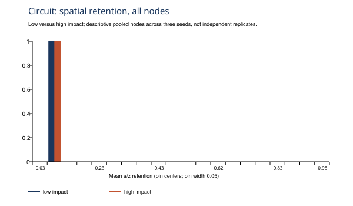

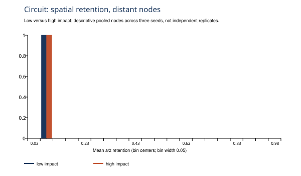

### Added step 2b: circuit depth shift

This exploratory addendum was requested after observing ordinary-circuit saturation. All 24 existing checkpoints (four policies, two grids, three seeds) were evaluated without retraining on the existing 256 48-node depth-shift validation roots. The primary table and contrasts use each policy's previously frozen ordinary-validation grid. Both grids, all seeds and all frames remain in the machine-readable records; depth-shift results were not used for selection. Circuit training used K1/2; K4/8 also extrapolate the rollout budget.

Mean post-edit full-circuit correctness (%)

| Policy | K1 | K2 | K4 | K8 |
|---|---|---|---|---|
| restart | 2.33 | 18.25 | 56.98 | 83.63 |
| carry | 0.51 | 1.11 | 1.95 | 2.43 |
| spatial_gate | 6.99 | 35.07 | 71.22 | 90.09 |
| answer_only | 7.46 | 38.35 | 74.22 | 88.36 |

Mean post-edit non-input-node accuracy (%)

| Policy | K1 | K2 | K4 | K8 |
|---|---|---|---|---|
| restart | 83.36 | 89.79 | 95.60 | 98.48 |
| carry | 70.78 | 74.05 | 76.64 | 77.83 |
| spatial_gate | 86.49 | 92.67 | 97.15 | 98.94 |
| answer_only | 86.66 | 93.03 | 97.41 | 98.81 |

| Arm minus restart | K | Difference (pp) | Paired 95% interval (pp) |
|---|---|---|---|
| answer_only | 1 | 5.13 | [4.35, 5.96] |
| answer_only | 2 | 20.10 | [18.60, 21.65] |
| answer_only | 4 | 17.24 | [15.56, 18.97] |
| answer_only | 8 | 4.73 | [3.29, 6.29] |
| spatial_gate | 1 | 4.67 | [3.79, 5.59] |
| spatial_gate | 2 | 16.82 | [15.21, 18.39] |
| spatial_gate | 4 | 14.24 | [12.55, 16.01] |
| spatial_gate | 8 | 6.47 | [4.90, 8.10] |

The positive answer-only criterion under structural shift is met at one or more tested budgets; this supports the second family specifically under this structural shift.

Depth-shift accuracy by training seed, using the frozen ordinary-validation grid:

| Policy | Training seed | K1 (%) | K2 (%) | K4 (%) | K8 (%) |
|---|---|---|---|---|---|
| restart | 29 | 2.22 | 16.50 | 55.51 | 83.06 |
| restart | 43 | 2.28 | 17.83 | 56.58 | 86.01 |
| restart | 71 | 2.48 | 20.42 | 58.86 | 81.81 |
| carry | 29 | 0.60 | 1.51 | 2.77 | 3.50 |
| carry | 43 | 0.67 | 0.96 | 1.16 | 1.17 |
| carry | 71 | 0.26 | 0.87 | 1.93 | 2.61 |
| spatial_gate | 29 | 6.42 | 31.98 | 69.79 | 90.23 |
| spatial_gate | 43 | 6.54 | 36.89 | 73.34 | 88.84 |
| spatial_gate | 71 | 8.02 | 36.34 | 70.54 | 91.20 |
| answer_only | 29 | 6.57 | 38.45 | 74.99 | 88.72 |
| answer_only | 43 | 6.35 | 36.80 | 70.79 | 87.56 |
| answer_only | 71 | 9.46 | 39.79 | 76.89 | 88.79 |

The following spatial_gate minus answer_only contrasts were requested after the sweep began. They are exploratory, were not declared Step2b contrasts, and do not reopen G2.

| Exploratory contrast | K | Difference (pp) | Paired 95% interval (pp) |
|---|---|---|---|
| spatial_gate minus answer_only | 1 | -0.46 | [-1.15, 0.22] |
| spatial_gate minus answer_only | 2 | -3.28 | [-4.57, -2.02] |
| spatial_gate minus answer_only | 4 | -3.00 | [-3.95, -2.03] |
| spatial_gate minus answer_only | 8 | 1.73 | [1.07, 2.40] |

Regime-dependent observation: answer-only beats the tested latent-reuse arms on in-distribution mazes; the learned gate's comparison with answer-only under circuit structural shift depends on K, as shown above. This does not establish prespecified noninferiority or change the declared G2 decision.

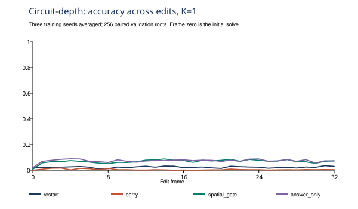

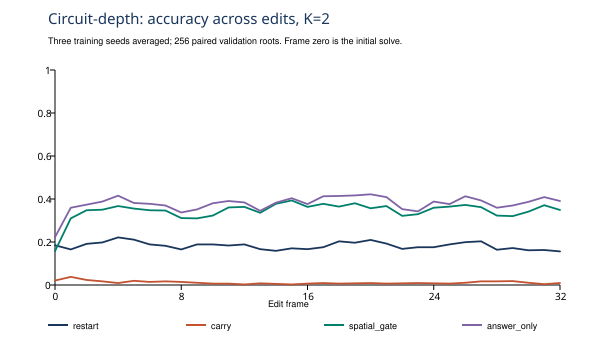

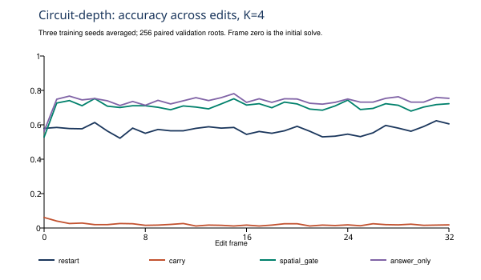

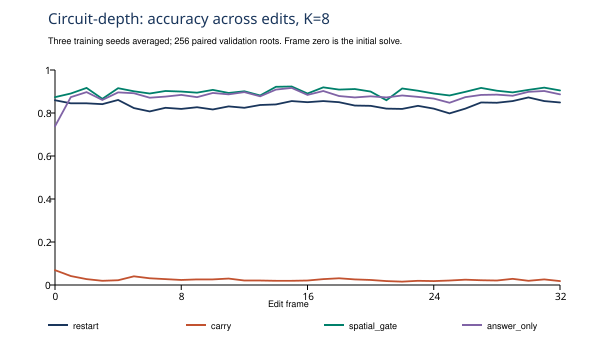

### Added step 1b: matched forward-call control

The original one-edit recipe was rerun from the common pretrained checkpoint for 626 updates, with the pilot-selected grid fixed per policy. The common step count was chosen from deterministic schedules, before training, to minimize the largest call-count mismatch across seeds. It matches total training solver forward calls within 5%; it does not equate backward-pass cost or wall time. No learning-rate selection used these addendum results.

| Policy | Seed | Steps | One-edit F calls | Stream F calls | Difference (%) |
|---|---|---|---|---|---|
| answer_only | 29 | 626 | 852480 | 864960 | -1.44 |
| answer_only | 43 | 626 | 892800 | 878400 | 1.64 |
| answer_only | 71 | 626 | 902400 | 917760 | -1.67 |
| carry | 29 | 626 | 852480 | 864960 | -1.44 |
| carry | 43 | 626 | 892800 | 878400 | 1.64 |
| carry | 71 | 626 | 902400 | 917760 | -1.67 |
| restart | 29 | 626 | 852480 | 864960 | -1.44 |
| restart | 43 | 626 | 892800 | 878400 | 1.64 |
| restart | 71 | 626 | 902400 | 917760 | -1.67 |
| spatial_gate | 29 | 626 | 852480 | 864960 | -1.44 |
| spatial_gate | 43 | 626 | 892800 | 878400 | 1.64 |
| spatial_gate | 71 | 626 | 902400 | 917760 | -1.67 |

| Policy | K1 (%) | K2 (%) | K4 (%) | K8 (%) |
|---|---|---|---|---|
| restart | 35.43 | 75.21 | 91.40 | 99.98 |
| carry | 54.59 | 53.04 | 49.77 | 45.64 |
| spatial_gate | 34.22 | 41.42 | 61.89 | 78.48 |
| answer_only | 60.58 | 83.28 | 95.45 | 99.57 |

| Longer policy minus stream spatial gate | K | Difference (pp) | Paired 95% interval (pp) |
|---|---|---|---|
| restart | 1 | -25.05 | [-29.86, -20.10] |
| restart | 2 | -2.70 | [-6.65, 1.27] |
| restart | 4 | 2.05 | [-0.90, 4.92] |
| restart | 8 | 5.53 | [4.31, 6.96] |
| carry | 1 | -5.90 | [-9.38, -2.34] |
| carry | 2 | -24.87 | [-28.22, -21.43] |
| carry | 4 | -39.58 | [-42.71, -36.38] |
| carry | 8 | -48.81 | [-52.18, -45.38] |
| spatial_gate | 1 | -26.26 | [-29.07, -23.51] |
| spatial_gate | 2 | -36.49 | [-39.78, -33.21] |
| spatial_gate | 4 | -27.45 | [-30.66, -24.27] |
| spatial_gate | 8 | -15.97 | [-18.54, -13.48] |
| answer_only | 1 | 0.10 | [-3.97, 4.26] |
| answer_only | 2 | 5.37 | [1.86, 8.83] |
| answer_only | 4 | 6.10 | [4.16, 8.09] |
| answer_only | 8 | 5.12 | [3.91, 6.52] |

Declared operational attribution: stream exposure: the matched-compute spatial gate does not satisfy the zero-containing paired-interval criterion at both K1 and K4.

That attribution is the requested screening rule, not a causal or equivalence proof. Failure to detect a difference does not establish equal performance, and a difference can reflect optimization or sample weighting as well as exposure to carried states. The original latent-reuse-versus-answer-only G2 result remains separately reported.

Matched-call control accuracy by training seed:

| Policy | Training seed | K1 (%) | K2 (%) | K4 (%) | K8 (%) |
|---|---|---|---|---|---|
| restart | 29 | 35.84 | 74.99 | 92.09 | 99.98 |
| restart | 43 | 35.49 | 76.22 | 91.03 | 99.98 |
| restart | 71 | 34.97 | 74.41 | 91.08 | 100.00 |
| carry | 29 | 50.82 | 50.11 | 49.19 | 46.74 |
| carry | 43 | 52.92 | 49.52 | 43.97 | 37.70 |
| carry | 71 | 60.02 | 59.48 | 56.15 | 52.49 |
| spatial_gate | 29 | 35.99 | 38.96 | 59.48 | 75.11 |
| spatial_gate | 43 | 34.74 | 46.29 | 65.73 | 82.28 |
| spatial_gate | 71 | 31.95 | 39.00 | 60.46 | 78.05 |
| answer_only | 29 | 60.46 | 84.77 | 96.36 | 99.41 |
| answer_only | 43 | 65.47 | 83.65 | 93.08 | 99.79 |
| answer_only | 71 | 55.82 | 81.41 | 96.90 | 99.51 |

### Scope and resources

Ordinary circuit output reuse does not establish positive answer-only minus restart intervals at both tested budgets. Restart is near ceiling, limiting headroom; the separate depth-shift result above defines whether there is support under structural shift.

Prompt-05b GPU-job wall time: 7.4768 hours across 213 reconciled jobs, under the separate 12-hour allowance. This includes 3 failed jobs, whose errors and synthetic labels remain in the resource records. Peak allocated GPU memory was 4.955 GiB; peak reserved memory was 5.084 GiB. External charges $0; electricity unmeasured. Job wall time includes CPU work inside GPU contexts. Retention values and K counts do not establish a speedup; measured cost comparisons belong to prompt 06.

Only one pretrained source checkpoint per family, three adaptation seeds, 256 stream-training updates (626 one-edit updates in the matched-call control), short training streams and exploratory pointwise validation intervals were studied. This does not establish convergence, broad task generality, arbitrary-K stability or a causal latent-repair mechanism. The per-frame restart curves are the distribution-drift reference. All arms, failures, full sequences, source snapshots and raw actions are preserved.
